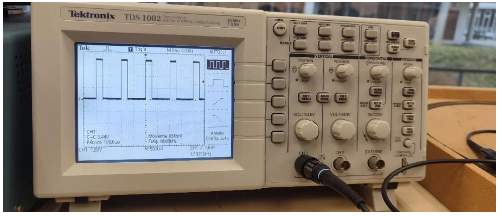
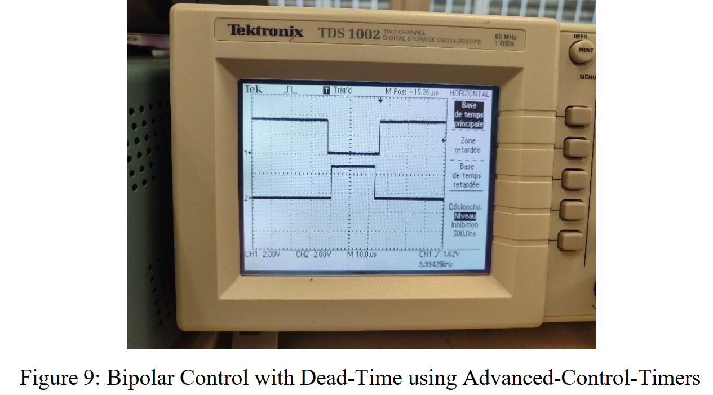

# Embedded Systems Labs: Ultrasonic Sensor & PWM Power Control

This repository contains two embedded systems projects developed for the **M1 Electric Vehicles Propulsion and Control** program at École Centrale de Nantes. The labs focus on timers, interrupts, PWM control, and sensor integration using STM32 microcontrollers.

---

## Lab 3: Ultrasonic Sensor Driver
### Overview
This lab implements a driver for an HC-SR04 ultrasonic sensor using GPIOs, timers, and interrupts. The sensor measures distance by calculating the time delay between trigger pulses and echo responses.

#### Key Features:
- **10Hz Trigger Signal** using TIM6.
- **Echo Pulse Measurement** via TIM7 (1µs resolution).
- **Rising/Falling Edge Detection** with EXTI interrupts.
- **Timeout Handling** for sensor unavailability (50ms threshold).
- **Distance Calculation**: `58 µs/cm` formula.

### Implementation Highlights
- **Trigger Configuration**:
  - PA10 is temporarily set as output to send a 10µs trigger pulse.
  - TIM6 generates a 10Hz interrupt for periodic triggering.
- **Echo Measurement**:
  - TIM7 acts as a stopwatch to capture pulse width.
  - EXTI detects rising/falling edges on PA10 (echo pin).
  - Distance is stored in a global variable and displayed on a TFT screen.
- **Timeout Handling**:
  - TIM7 interrupts flag sensor unavailability if no echo is detected within 50ms.

---

## Lab 4: PWM Control for Power Converters
### Overview
This lab demonstrates PWM generation, interrupt-driven duty cycle variation, and control of buck/boost converters using STM32 timers. Advanced features like dead-time insertion for full-bridge converters are also implemented.

#### Key Features:
- **PWM Configuration** at 10kHz (TIM2, TIM1).
- **Duty Cycle Modulation** (0–100%) via ADC or interrupts.
- **IP Controller** with anti-windup for current regulation.
- **Bipolar PWM Control** using complementary channels.
- **Dead-Time Generation** with advanced timers (TIM1).

### Implementation Highlights
- **PWM Setup**:
  - TIM2 (32-bit) configured for edge-aligned PWM (10kHz, 25% duty cycle).
  - Code snippets for active-high/low modes and down-counter configurations.
- **Interrupt-Driven Updates**:
  - Timer overflow interrupts adjust duty cycle dynamically.
  - GPIO toggling (PA1) verifies ISR synchronization.
- **Advanced Control**:
  - **IP Controller**: Discrete-time implementation with trapezoidal approximation.
  - **Dead-Time Insertion**: TIM1’s `BDTR` register configures 2µs dead-time for complementary outputs.
  - Full-bridge converter control logic (IN1/IN2 signals).

### Simulation Results (Example)
| PWM Signal (Active High) | Dead-Time Measurement |
|--------------------------|-----------------------|
|  |  |

---

## Repository Structure
